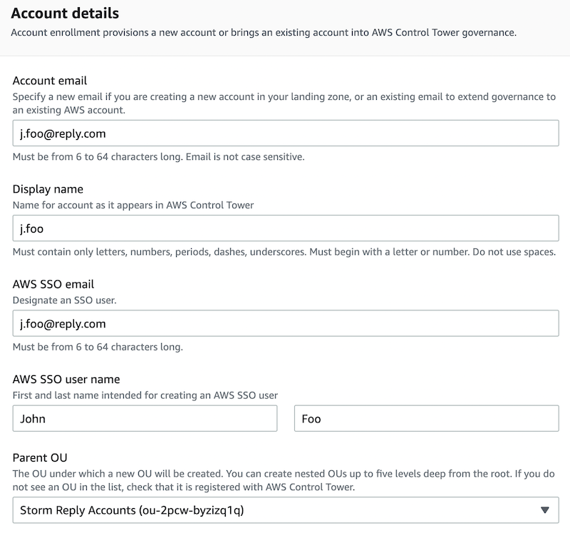

# Create a personal account

## Overview
This workbook is for the creation of a personal account under the control of Sustainable Personal Accounts (SPA). This account will be used as a sandbox, or as a suitable context for software development.

1. [Validate capabilities of the requester](#step-1)
2. [Validate the request for an AWS account](#step-2)
3. [Create a new AWS account](#step-3)
4. [Activate the new AWS account](#step-4)
5. [Validate access to the AWS Console](#step-5)

Note: The integration of an existing AWS account has proven painful. It is a far better option to create accounts directly from the Account factory, as described below.

## Prerequisites
- You have credentials to access the AWS Console for the Master Account of the target AWS Organization.
- You have needed permissions to manage Control Tower and Account Factory

## Step 1 - Validate capabilities of the requester 

Accessing an AWS account is equivalent, in the virtual world, or accessing freely a data center in the physical world. You can rack servers, deploy networks and a variety of appliances, etc. With such powers come great responsibilities, including the prevention of security breaches and the containing of costs.

Therefore, we suggest to provide AWS account only to people who are in capacity to master related responsibilities. Following criteria can be used to take a decision:

- The person has been certified by AWS at Associate level or more. This includes all AWS Associate, Professional and Specialty certifications. For example, AWS Solution Architect Associate is valid. But AWS Cloud Practitioner is not. AWS Partner badges are not valid either.
- Alternatively, a practice for 2+ years of the AWS Console, SDK and APIs is a valid alternative of the certification.

## Step 2 - Validate the request for an AWS account 

Following details have to be provided to provision a new personal AWS account:
- First name
- Last name
- Corporate e-mail address, e.g., `j.foo@example.com`
- Organization that is owning the budget for cloud resources (aka, name of a business unit or of a team)

Ideally, the request should be submitted by the owner of cloud budget, for proper separation of duties. Also, the request should be accepted by the team in charge of SPA operations.

## Step 3 - Create a new AWS account 

We recommend to use the Account Factory of the Control Tower to create new AWS accounts. In the background, Control Tower is leveraging provisioned products from AWS Service Catalog.

Guided activities for the creation of a new personal AWS account include:
- Authenticate to AWS SSO
- From the AWS page, assume role for the Master Account
- From the AWS Console, go to the AWS Control Tower service page
- In the menu on the left of the page, select Account Factory
- From the Account Factory page, click on the Create Account button
- For Account Details, use the e-mail address of the person for the Account e-mail and for the AWS SSO email, e.g., `j.foo@reply.com`. For the Display name, use the first part of the email address, e.g., `j.foo`. Then for the AWS SSO User Names, add first and last names, e.g., `John` and `Foo`. Also pick up the appropriate OU. Click on the Create account button at the bottom of the page
- This will launch a process to create an account that you can monitor in Service Catalog, on the menu for Provisioned Products. Note that the creation process can take 20 minutes or more.

## Step 4 - Activate the new AWS account 

The person will receive messages over e-mail for the connection to new AWS account.

1. The message related to the root connection to the new AWS account should not be used at all, if any
2. The other message from SSO that is mentioning the Start URL is the one to be used
3. Follow the process for initial connection, including the setup of Multiple Factor Authentication (MFA). A popular approach is to install Google Authenticator application on smartphone with personal GMail address.

## Step 5 - Validate access to the AWS Console 

The person who created the account should arrange a quick enablement session with the person receiving an account. During this interactive session:

1. Invite the person to open an incognito window and visit the Start URL
2. Sign in into AWS SSO, including MFA
3. When the Start URL is displayed, listing all accessible accounts, invite the person to bookmark this page in the toolbar for easy retrieval
4. Ask the person to navigate the AWS Console for his personal account. Notice that he/she has `AWSAdministratorAccess` to everything, therefore the responsibility on security and costs.
5. Visit the Billing Console to show Budgets and the alert that is managed on the behalf of consultants.

Some guidelines for the usage of a personal AWS account:
- This is not an IAM user in a shared AWS account. SPA provides an entire AWS account to a single person.
- Since provisioned cloud resources incur costs, it is the responsibility of each person to delete unused resources as soon as possible.
- Each person has a limited budget for resource consumption and will receive alerts if spending go too high. We expect quick reactions on such events to minimize cloud costs.
- No production workload should be deployed on personal accounts. Use other non-personal AWS account for such use cases
- Each person should contribute to shared responsibility models related to cloud computing. Beware of security, and ensure that deployed resources do preserve confidentiality, integrity and availability of corporate assets of your company.

